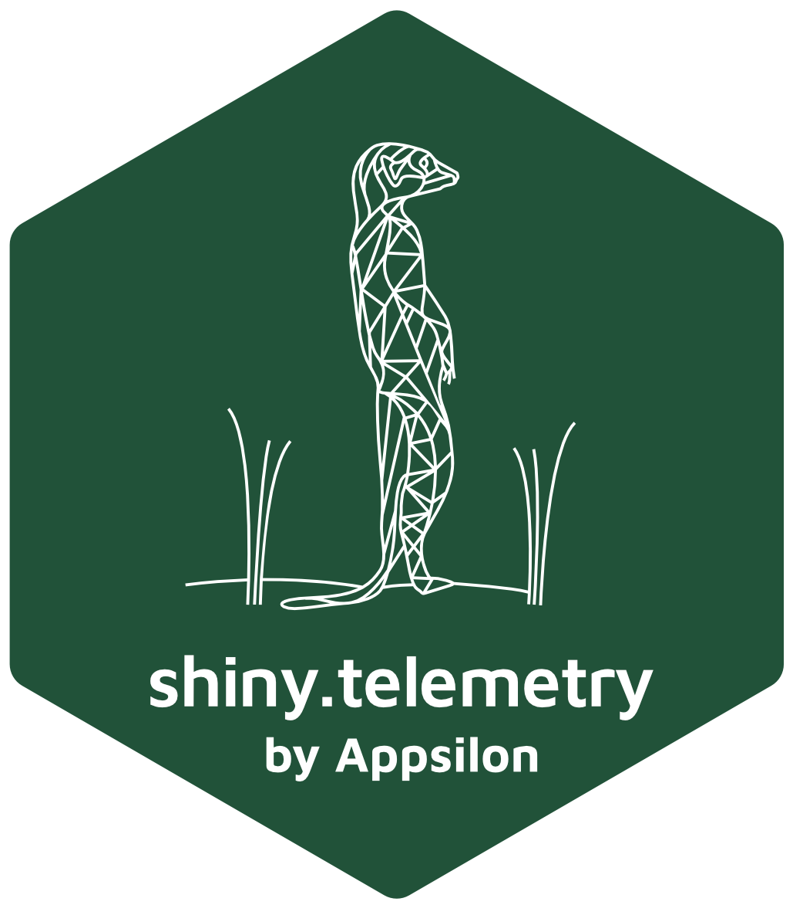

# shiny.telemetry <a href="https://appsilon.github.io/shiny.telemetry/"></a>

> Easy logging of users activity and session events of your Shiny App

[](https://cran.r-project.org/package=shiny.telemetry)
[](https://github.com/Appsilon/shiny.telemetry/actions/workflows/main.yml)
[](https://CRAN.R-project.org/package=shiny.telemetry)
[](https://CRAN.R-project.org/package=shiny.telemetry)
[](https://opensource.org/license/lgpl-3-0/)

The `shiny.telemetry` R package tracks events occurring on a user session,
such as input changes and session duration, and stores them in a local or remote database.

It provides developers with the tools to help understand how users interact with Shiny dashboards
and answer questions such as: which tabs/pages are more often visited,
which inputs users are changing, what is the average length of a session, etc.

## Install

The `shiny.telemetry` package can be installed from GitHub by using the remotes package:

```R
remotes::install_github("Appsilon/shiny.telemetry", dependencies = TRUE)
```

With `dependencies = TRUE` the suggested packages (required to run some examples)
will be installed in addition to mandatory dependencies.

## How to use in a Shiny Dashboard?

`shiny.telemetry` allows for a minimal setup with only 3 commands
that can track some information about the session:

* When session starts and ends
* The browser version used by the client
* Changes in the inputs _(doesn't track values by default)_

The code below runs a minimal example of a Shiny application that uses `shiny.telemetry`.
The package will keep track of the session information and all changes to the `numericInput`.

_Note_: When using the dashboard nothing is happening from the user's perspective
as all operation run in the background _(either in the server or in Javascript)_.

```r
library(shiny)
library(shiny.telemetry)

telemetry <- Telemetry$new() # 1. Initialize telemetry with default options

shinyApp(
  ui = fluidPage(
    use_telemetry(), # 2. Add necessary Javascript to Shiny
    numericInput("n", "n", 1),
    plotOutput('plot')
  ),
  server = function(input, output) {
    telemetry$start_session() # 3. Minimal setup to track events
    output$plot <- renderPlot({ hist(runif(input$n)) })
  }
)
```

When inspecting the code above, we can breakdown the 3 lines of code by:

1. Global `Telemetry` object that is used across the different sessions
2. Add necessary Javascript to the UI by calling `use_telemetry()`.
It is used to track browser version.
3. Initialize the session-specific tracking
by calling method `start_session()` of the `Telemetry` object.

## How to access the data?

The developers and administrators of the dashboard can access the data that is gathered by `shiny.telemetry` via a Telemetry object or directly from `DataStorage` via the appropriate provider.

```R
# After running the instrumented app
shiny.telemetry::Telemetry$new()$data_storage$read_event_data("2020-01-01", "2050-01-01")

# Default provider and path for Telemetry$new()
shiny.telemetry::DataStorageSQLite$new(db_path = "telemetry.sqlite")$read_event_data("2020-01-01", "2050-01-01")
```

The package includes an analytics dashboard to view the data.
It is located at `inst/examples/app/analytics` and it should be modified
so that it references the correct `DataStorage` provider and configuration.

## Data providers

There are 3 different types of data providers
that can range from local filesystem storage to a remote Plumber REST API instance.

* Local file:
  * SQLite using `DataStorageSQLite` class
  * Logfile using `DataStorageLogFile` class
* Remote SQL database:
  * MariaDB using `DataStorageMariaDB` class
  * PostgreSQL using `DataStoragePostgreSQL` class
  * MS SQL Server using `DataStorageMSSQLServer` class
* Plumber REST API using `DataStoragePlumber` class
  * In turn, the Plumber data provider will use one of the other classes above
  as the method of data storage.

The setup for plumber requires a valid Plumber instance running on the network
and the communication can be protected.
See Plumber deployment documentation for more information.

## Debugging the Telemetry calls

The package uses the `logger` package internally with the `shiny.telemetry` namespace.
To debug the `shiny.telemetry` calls in the dashboard,
change the threshold of this namespace to `DEBUG`:

```r
logger::log_threshold("DEBUG", namespace = "shiny.telemetry")
```

_note_: This command can be run before the Shiny call or by adding it to the `.Rprofile`.

## Contributing
See [CONTRIBUTING](./CONTRIBUTING.md).

## Appsilon


Appsilon is a **Posit (formerly RStudio) Full Service Certified Partner**.<br/>
Learn more at [appsilon.com](https://appsilon.com).

Get in touch [opensource@appsilon.com](mailto:opensource@appsilon.com)

Explore the [Rhinoverse](https://rhinoverse.dev) - a family of R packages built around [Rhino](https://appsilon.github.io/rhino/)!

<a href = "https://appsilon.com/careers/" target="_blank"></a>
