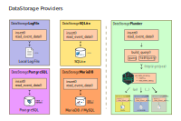

# Plumber REST API as a DataStorage provider for shiny.telemetry

> REST API that receives write and read requests for telemetry data from a Shiny Dashboard _(using `shiny.telemetry` R 📦)_

This [plumber](https://www.rplumber.io/) REST API serves as a middleware between a [Shiny](https://shiny.rstudio.com/) Application that is being monitored by `shiny.telemetry` and a data backend that write the logging information to persistent storage.

The data backend is provided by the `shiny.telemetry` R package.

Features:

* Supports all data storage backends available to `shiny.telemetry`
* Validates origin of messages by signing message _(see [section below](#setup-signature))_
* Supports secure communication when API is deployed in a server that supports _Hypertext Transfer Protocol Secure (HTTPS)_



## Setup

To get a minimal Plumber instance running locally it requires an `R` environment _(at least `≥v4.1`)_ and the `renv` R package.

Start by downloading or cloning the source files in the repository and open an R session on the `/plumber_rest_api` directory.

Install the required packages by calling `renv::restore()` inside the R session.

```R
> renv::restore()
```

Start the Plumber API by sourcing `plumber.R` file or by calling `plumber::plumb("plumber.R")`.

```R
> # source("plumber.R")
> plumber::plumb("plumber.R")
```

The plumber instance is now running and the API documentation can be accessed via [127.0.0.1:8087/__docs__/](http://127.0.0.1:8087/__docs__/). The `/health_check` endpoint can be used without any parameters.

In order to test as a `shiny.telemetry` data storage provider, you can run the code below in an R session.

The example will:

1. Create an instance of the `DataStoragePlumber` R6 class configured to use the local Plumber instance
1. Manually log several pieces of information:
    * Login
    * 2 Clicks
    * Session detail
1. Read the action and session logs
    * note the timestamps

```R
library(shiny.telemetry)
data_storage <- DataStoragePlumber$new(
  username = "test_user",
  hostname = "127.0.0.1",
  port = 8087,
  protocol = "http"
)

log_login(data_storage)
log_click(data_storage, "an_id")
log_click(data_storage, "a_different_id")

data_storage$read_event_data("2020-01-01", "2035-01-01")
```

## Communication signature & validation

As a security feature, it is possible to sign the messages exchanged between `shiny.telemetry` and this API so that we can guarantee that only un-modified information from known sources are stored.

The method uses a secret token that is defined as an environment variable on both the Shiny application and in the deployed API. The API can support multiple tokens and by default it uses no signature, so this feature is disabled.

In technical terms, the parameters of the requests are transmitted in plain text with the signature _(of the parameters)_ and an unique identifier of the secret that is being used.

Note that, the data in the message being transmitted via the HTTP protocol is not encrypted _(consider using https for this purpose)_.

### Setup Signature

To setup the message signature it is required to define:

* In the Plumber API Environment: `SECRET_TOKENS="<string-token-a> <string-token-b>`
* In the Shiny Application instrumented by `shiny.telemetry`: `PLUMBER_SECRET=<string-token-a>`
    * In this case, for "Shiny Application A"

ℹ️ Important: the different tokens defined in the API are separated by spaces.

## Appsilon


Appsilon is a **Posit (formerly RStudio) Full Service Certified Partner**.<br/>
Learn more at [appsilon.com](https://appsilon.com).

Get in touch [opensource@appsilon.com](mailto:opensource@appsilon.com)

Check the [Rhinoverse](https://rhinoverse.dev).

<a href = "https://appsilon.com/careers/" target="_blank"></a>
