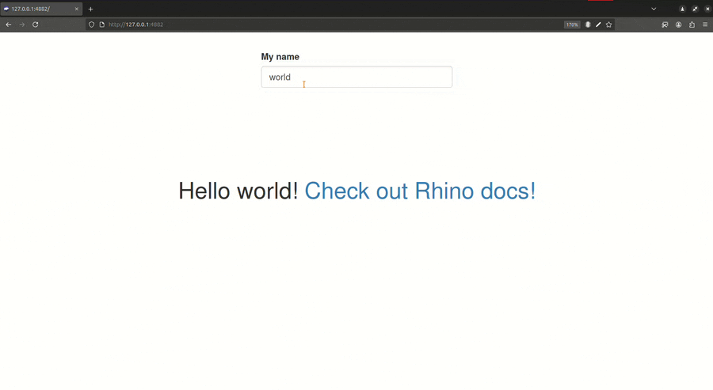
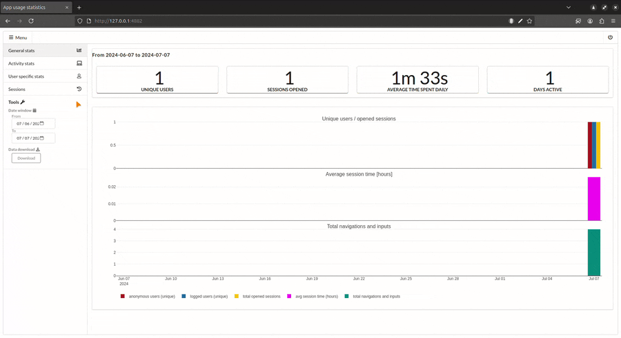

```{r, include = FALSE}
knitr::opts_chunk$set(
  collapse = TRUE,
  comment = "#>"
)
```

The `{shiny.telemetry}` package can be used with any Shiny application and in this guide we will show how to add it to a [{rhino} application](https://appsilon.github.io/rhino/).

<div style="float: right;">
<a href="https://appsilon.github.io/rhino/" target="_blank"></a>
<a href="https://appsilon.github.io/shiny.telemetry/"></a>
</div>

`{rhino}` is a package that provides a framework to build high quality, enterprise-grade Shiny apps at speed.
It is designed to help you build Shiny apps that are scalable, maintainable, and robust.

Using `{shiny.telemtry}` with `{rhino}` is very simple and it requires only a few lines of code just as any other app.

Useful links:

- [Creating your first Rhino app](https://appsilon.github.io/rhino/articles/tutorial/create-your-first-rhino-app.html)
- [App structure in a Rhino application](https://appsilon.github.io/rhino/articles/explanation/application-structure.html)
- [Write R code in Rhino](https://appsilon.github.io/rhino/articles/how-to/write-r-code.html)
- [Use External Databases with `{shiny.telemetry}`](https://appsilon.github.io/shiny.telemetry/articles/shiny-telemetry-databases.html)

## Creating a new `{rhino}` application

Starting a new `{rhino}` application is as simple as running the `rhino::init()` command.
Learn more about "Creating your first Rhino app" [in this guide](https://appsilon.github.io/rhino/articles/tutorial/create-your-first-rhino-app.html).

The command creates a boilerplate folder structure for a `{rhino}` application, where `app/main.R` contains the UI and server logic.
The application structure is best explained on this ["App structure" documentation](https://appsilon.github.io/rhino/articles/explanation/application-structure.html).

Before setting up `{shiny.telemetry}` in the application, let's add a simple input element to the boilerplate code. Otherwise, the only events that will be tracked are the login, logout and the user's browser version.

For this we will add a text input to the application and in the sections below observe how it is being tracked by `{shiny.telemtry}`.

Adding the code below to the `app/main.R` file will add a text input and a "Hello world" message with the contents of the input.

```r
# app/main.R (replace with the following code)
box::use(
  shiny[
    bootstrapPage, div, moduleServer, NS, renderUI, tags, textInput, uiOutput, 
    verbatimTextOutput,
  ],
)

#' @export
ui <- function(id) {
  ns <- NS(id)
  bootstrapPage(
    textInput(ns("name"), "My name", "world"),
    verbatimTextOutput(ns("text")),
    uiOutput(ns("message"))
  )
}

#' @export
server <- function(id) {
  moduleServer(id, function(input, output, session) {
    output$message <- renderUI({
      div(
        style = "display: flex; justify-content: center; align-items: center; height: 50vh;",
        tags$h1(
          tags$span(sprintf("Hello %s! ", input$name)),
          tags$a("Check out Rhino docs!", href = "https://appsilon.github.io/rhino/")
        )
      )
    })
  })
}

```

### Using an existing `{rhino}` application

Alternatively, you can add `{shiny.telemetry}` to an existing `{rhino}` application by following the steps in the next sections.

Please note, that if there are no input elements in the application, the only events that will be tracked are the login, logout and the user's browser version.

## Setup `{shiny.telemetry}`

The following 4 steps are needed to start using `{shiny.telemetry}` for tracking inputs in the application:

1. Import functions from `{shiny.telemetry}` using `{box}`;
1. Add Javascript code to UI definition;
1. Create a `Telemetry` object;
1. Start telemetry session attached to a Shiny session.

The first step is to install `{shiny.telemetry}` with:

```r
rhino::pkg_install("shiny.telemetry")
```

### Import functions from `shiny.telemetry`

The `{rhino}` frameworks promotes the use of `{box}` to import functions from packages and internal modules.
See the `{rhino}` documentation on how to [write R code](https://appsilon.github.io/rhino/articles/how-to/write-r-code.html) for more details.

The minimal setup for `{shiny.telemetry}` needs to import:

- Class for the chosen `DataStorage` backend (e.g. `DataStorageLogFile` for a text-based storage, `DataStorageMariaDB` for a MariaDB database, among others);
- Class for the Telemetry function that will track all the events;
- Function to load the necessary Javascript code in the UI definition.

Any additional function that is being used, needs to be imported as well.
This can be done by adding the following code to the top of `app/main.R` file on the package imports:

```r
# app/main.R (top of file)
box::use(
  shiny[
    bootstrapPage, div, moduleServer, NS, renderUI, tags, textInput, uiOutput,
    verbatimTextOutput,
  ],
  # other packaage imports ...
  shiny.telemetry[DataStorageLogFile, Telemetry, use_telemetry],
)
```

### Add Javascript code to UI definition

The next step is to call `use_telemetry()` function in the root UI definition on `app/main.R` file to load the necessary Javascript code.

Note that the `id` parameter needs to be passed to the `use_telemetry()` function to ensure that the browser version is tracked correctly, as well as the mechanism to track anonymous user via client side cookies.

```r
# app/main.R (change n `ui` function)
#' @export
ui <- function(id) {
  ns <- NS(id)
  bootstrapPage(
    use_telemetry(id),
    tags$div(
      style = "display: flex; justify-content: center; align-items: center; margin-top: 2em;",
      textInput(ns("name"), "My name", "world")
    ),
    verbatimTextOutput(ns("text")),
    uiOutput(ns("message"))
  )
}
```

### Create `Telemetry` object

The next step is to create a `Telemetry` object that will be used to track events in the app.

We recommend creating an instance of `Telemetry` on the `app/main.R` and then start the telemetry session on the root `server` function definition, just as shown in the code below.

This will create a text file with the events tracked by `{shiny.telemetry}`.
It is the simplest storage backend available and the file contains JSON data that can be easily read and processed. 

To learn about other backends see the ["Use External Databases with shiny.telemetry" guide](databases.Rmd).

Please note, that the values themselves are not tracked by default and need to be enabled by setting the `track_values` parameter to `TRUE` in the [`start_session()`](https://appsilon.github.io/shiny.telemetry/reference/Telemetry.html#method-Telemetry-start_session) method.
In this example we are enabling them to help demonstrate the capabilities of `{shiny.telemetry}`.

```r
# app/main.R (create telemetry object and initialize in a session)
telemetry <- Telemetry$new(
  app_name = "rhino_app",
  data_storage = DataStorageLogFile$new("local_file.txt")
)

#' @export
server <- function(id) {
  moduleServer(id, function(input, output, session) {
    telemetry$start_session(track_values = TRUE)
    # Server logic ...
  })
}
```

The [`telemetry$start_session()`](https://appsilon.github.io/shiny.telemetry/reference/Telemetry.html#method-Telemetry-start_session) call can be customized to enable/disable different types of events and can be further extended to include/exclude input ids.
See the [Guide on tracking specific inputs](tracking-specific-input-id) for more details.

The application is now ready to track the input changes, login, logout and browser version. Start the application and test it out yourself.

```r
shiny::runApp() # Start the application and change inputs 
```



## Access the events

The `{shiny.telemetry}` package provides a default dashboard to visualize the events tracked by the application.
In this example we will use the `local_file.txt` that has been configured in the application.

To start the dashboard run the code below after installing the suggested packages (`renv::install("semantic.dashboard", "shinyjs", "plotly", "timevis", "DT")`)

```r
# Required suggested packages:
#  renv::install("semantic.dashboard", "shinyjs", "plotly", "timevis", "DT")
library(shiny.telemetry)

data_storage <- DataStorageLogFile$new("local_file.txt")
analytics_app(data_storage = data_storage)
```

This will start a dashboard that will show the events tracked by the application.
It shows:

- General stats with the number of events, unique users and average session;
- Activity stats with event data by input id;
- User stats with session by same user 
    - Returning anonymous users are tracked by client side cookies;
- Session stats with duration and activity per user session.



Other examples for the different backends can be found in the `inst/examples` folder of the package.

## Conclusion

To use `{shiny.telemetry}` with rhino, you only need to make 4 minor adjustments that adds six lines of code _(with default options)_.
It is as easy as doing it with any other Shiny application.

The setup allows to access all of `{shiny.telemetry}` functionality to write events to a data storage backed and it will write 4 types of events:

- Login timestamp with username _(if available)_;
- Browser user agent;
- Logout timestamp when the session ends;
- All input changes.

To learn how to use Database backends you can refer to the ["Use External Databases with shiny.telemetry" guide](https://appsilon.github.io/shiny.telemetry/articles/shiny-telemetry-databases.html).

#### Alternative methods to access event data

The event data can be accessed directly, either via the `DataStorage` API in `{shiny.telemetry}` or by accessing the data directly in the backend.

The `DataStorage` API has 2 main functions to read and write data to the respective backend.

1. [`read_event_data()`](https://appsilon.github.io/shiny.telemetry/reference/DataStorage.html#method-DataStorage-read_event_data) used to read data from the backend and returns a data frame with the events data;
    - Optionally parameters can be used to limit the results by data range and application name;
2. [`insert`](https://appsilon.github.io/shiny.telemetry/reference/DataStorage.html#method-DataStorage-insert) used to write new events to the backend.

To read all the data being tracked in this example we can run the following code:

```{r fake_code, eval=FALSE}
library(shiny.telemetry)
data_storage <- DataStorageLogFile$new("local_file.txt")
data_storage$read_event_data()
```

```{r pseudo_data_storage_read, echo=FALSE}
# Code that replicates the example above
session_id <- sprintf("%s...", substr(rlang::hash(Sys.time()), 1, 6))
user_id <- sprintf("%s...", substr(rlang::hash(list(Sys.time(), session_id)), 1, 6))
time <- Sys.time()
data_storage <- shiny.telemetry::DataStorageLogFile$new(withr::local_file("local_file.txt"))
telemetry <- shiny.telemetry::Telemetry$new(app_name = "rhino_app", data_storage)
session <- shiny::MockShinySession$new() # Create dummy session (only for example purposes)
class(session) <- c(class(session), "ShinySession")
session$token <- session_id

telemetry$log_login(user_id, session = session)
telemetry$log_input_manual("name", "John Doe", session = session)
telemetry$log_input_manual("name", "Jane Doe", session = session)
telemetry$log_input_manual("name", "My custom name", session = session)
testthat::with_mocked_bindings(
  telemetry$log_logout(user_id, session = session),
  onSessionEnded = function(fun, ...) fun(),
  .package = "shiny" 
)

knitr::kable(data_storage$read_event_data())
```
## Appendix: Use an External Database

The storage backend can be swapped between the JSON log file used above to an external database by just changing the `data_storage` parameter when initializing `{shiny.telemetr}`. To learn how to use the different available Database backends you can refer to the ["Use External Databases with shiny.telemetry" guide](https://appsilon.github.io/shiny.telemetry/articles/shiny-telemetry-databases.html).

In this section we will show how to use PostgreSQL, which is one of the supported databases in a Rhino application. Using any of the others is similar.

The only necessary modification in the code is to replace the `DataStorageLogFile` with `DataStoragePostgreSQL` and provide the necessary connection information.

However, we recommend using environment variables to store sensitive information, such as passwords, and avoid storing them directly in the code. As such, we will use the `config.yml` and `.Renviron` files to keep this information safe.

The first step is changing the data storage backend in `app/main.R` file.

```r
# app/main.R (change the data storage backend)
telemetry <- Telemetry$new(
  app_name = "rhino_app",
  data_storage = DataStoragePostgreSQL$new(
    user = config$get("postgres_user"),
    password = config$get("postgres_pass"),
    hostname = config$get("postgres_host"),
    port = config$get("postgres_port"),
    dbname = config$get("postgres_dbname"),
    driver = "RPostgreSQL"
  )
)
```

Notice that we are using the `{config}` package to read the secrets from the `config.yml` file.
Therefore the next step is to import the `{config}` package with `{box}` in the `app/main.R` file.

```r
# app/main.R (top of the file)
box::use(
  config, # Adds config package that reads config.yml file at the root of the project
  shiny[
    bootstrapPage, div, moduleServer, NS, renderUI, tags, textInput, uiOutput,
    verbatimTextOutput,
  ],
  # other packaage imports ...
  shiny.telemetry[DataStorageLogFile, Telemetry, use_telemetry],
)
```

The `config.yml` can be configured to read the secrets for the environment, as well allowing for different configurations for different environments.
It is safe to commit this file to a repository as it does not contain any sensitive information itself.

```yaml
# config.yml
default:
  rhino_log_level: !expr Sys.getenv("RHINO_LOG_LEVEL", "INFO")
  rhino_log_file: !expr Sys.getenv("RHINO_LOG_FILE", NA)
  postgres_user: !expr Sys.getenv("POSTGRES_USER", NA)
  postgres_pass: !expr Sys.getenv("POSTGRES_PASS", NA)
  postgres_host: !expr Sys.getenv("POSTGRES_HOST", NA)
  postgres_port: !expr Sys.getenv("POSTGRES_PORT", 5432)
  postgres_dbname: "shiny_telemetry"
  
staging:
  postgres_dbname: "shiny_telemetry_stg"

production:
  postgres_dbname: "shiny_telemetry_prd"
```

The last change is on the `.Renviron` file that will keep the secrets safe and avoid storing them directly in the code. As long as this file is not committed to the repository, the secrets will be safe.

When deploying an application to POSIT Connect or ShinyProxy, the secrets can be set as environment variables in the deployment configuration.

```
# .Renviron
POSTGRES_USER=postgres
POSTGRES_PASS=mysecretpassword
POSTGRES_HOST=127.0.0.1
```

See the Rhino guide to ["Manage secrets and environments"](https://appsilon.github.io/rhino/articles/how-to/manage-secrets-and-environments.html) for more details on the best practices to manage secrets and environments.
